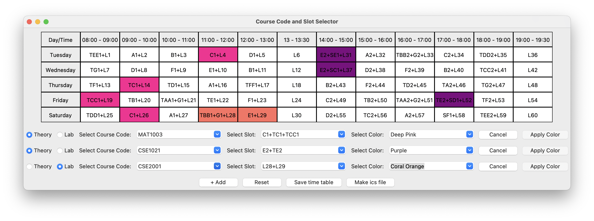

---
## Hello VITIANS



This is a GUI application that lets you design your timetable quick and efficiently

## Tutorial

Check out this [YouTube video](https://youtu.be/TWTq3HGRehc?si=qYV5W9-gFurCl5Mc) for a detailed tutorial.

#### Prerquisites 
You need to have Python and pip installed on your computer. You can download Python from [python.org](https://www.python.org/) and pip usually comes bundled with it.

### Quick Start
1. Clone the computer

```console
git clone git@github.com:suryatejess/vit-course-reg-planner.git
```
> If you **do not have git installed on your computer or dont know how ot use git**, just download the zip file. 

2. Install library's 
```
pip install -r requirements.txt
```
or 
```
pip3 install -r requirements.txt
```

3. Go to the project directory.

4. Run the program and design your timetable.
```
python3 primary_window.py
```
or 
```
python primary_window.py
```
---


